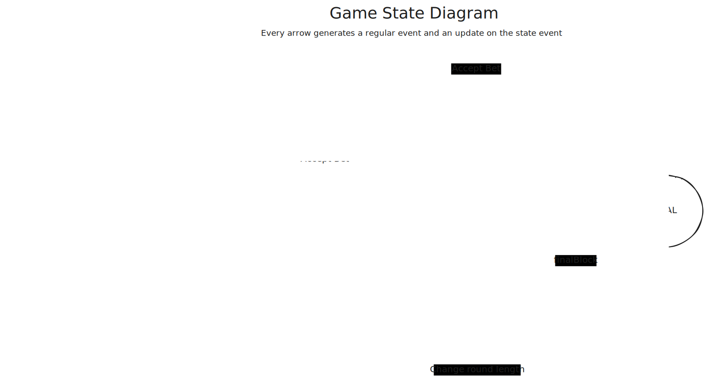

# Halving Massacre Game
This module hosts a Halving Massacre Game, being responsible for all the
tracking, calculations and communication.

## The Game


### Published events
This module publishes the following events:

#### State
```json
{
  "kind": 31111,
  "tags": [
    ["e", "<id>", "wss://relay.lawallet.ar", "setup"],
    ["d", "state"],
    ["L", "halving-massacre"],
    ["l", "state", "halving-massacre"],
    ["block", "current_block"]
  ],
  "content": {
    "current_block": block_number,
    "participants": {
      "lud16": "amount",
      ...
    },
    "next_freeze": block_number,
    "next_halving": block_number,
    "status": "SETUP" | "INITIAL" | "NORMAL" | "FREEZE" | "FINAL"
 },
 ...(id, pubkey, sig, created_at)
}
```

#### Setup
```json
{
  "kind": 1112,
  "tags": [
    ["p", "<creator>"],
    ["L", "halving-massacre"],
    ["l", "setup", "halving-massacre"],
    ["block", "current_block"]
  ],
  "content": {
      "initial_pool": "millisats",
      "final_block": number,
      "lock_duration": number,
      "ticket_price": number,
      "min_bet": "millisats"
  },
 ...(id, pubkey, sig, created_at)
}
```

#### Ticket
```json
  "kind": 1112,
  "tags": [
    ["p", "<comprador>"], //optional
    ["e", "<id>", "wss://relay.lawallet.ar", "setup"],
    ["e", "<id>", "wss://relay.lawallet.ar", "zap-receipt"],
    ["L", "halving-massacre"],
    ["l", "ticket", "halving-massacre"],
    ["i", "lud-16"],
    ["block", "current_block"]
  ],
  "content": {
      "participant": "lud-16"
  }
 ...(id, pubkey, sig, created_at)
```

#### Bet Receipt
```json
  "kind": 1112,
  "tags": [
    ["p", "<comprador>"], //opcional
    ["e", "<id>", "wss://relay.lawallet.ar", "setup"],
    ["e", "<id>", "wss://relay.lawallet.ar", "zap-receipt"],
    ["L", "halving-massacre"],
    ["l", "bet-receipt", "halving-massacre"],
    ["i", "lud-16"],
    ["amount", "millisats"],
    ["block", "current_block"]
  ],
  "content": {
      "amount": "millisats",
      "participant": "lud-16"
  }
 ...(id, pubkey, sig, created_at)
```

#### Start
```json
  "kind": 1112,
  "tags": [
    ["e", "<id>", "wss://relay.lawallet.ar", "setup"],
    ["L", "halving-massacre"],
    ["l", "start", "halving-massacre"],
    ["block", "current_block"]
  ],
  "content": JSON.stringify({
      "initial_block": number,
      "round_length": number,
  }),
 ...(id, pubkey, sig, created_at)
```

#### Freeze
```json
  kind: 1112,
  "tags": [
    ["e", "<id>", "wss://relay.lawallet.ar", "setup"],
    ["e", "<id>", "wss://relay.lawallet.ar", "zap-receipt"],
    ["L", "halving-massacre"],
    ["l", "freeze", "halving-massacre"],
    ["block", "current_block"]
  ],
  "content": {
    "current_block": block_number,
    "participants": {
      "lud16": "amount",
      ...
    }
  }
 ...(id, pubkey, sig, created_at)
```

#### Change round length
```json
  "kind": 1112,
  "tags": [
    ["e", "<id>", "wss://relay.lawallet.ar", "setup"],
    ["L", "halving-massacre"],
    ["l", "change-round-length", "halving-massacre"],
    ["block", "current_block"]
  ],
  "content": {
      "round_length": number,
  },
 ...(id, pubkey, sig, created_at)
```

#### Massacre
```json
  "kind": 1112,
  "tags": [
    ["e", "<id>", "wss://relay.lawallet.ar", "setup"],
    ["e", "<id>", "wss://relay.lawallet.ar", "zap-receipt"],
    ["L", "halving-massacre"],
    ["l", "massacre", "halving-massacre"],
    ["block", "current_block"],
    ["hash", "block_hash"]
  ],
  "content": {
    "current_block": block_number,
    "hash": hash,
    "participants": {
      "lud16": "amount",
      ...
    }
  }
 ...(id, pubkey, sig, created_at)
```


## Contributing

### Installation

```bash
pnpm i
```

### Testing

```bash
pnpm test
```

### Linting and prettier

```bash
pnpm lint
pnpm prettier
```

### Development Server

```bash
pnpm dev
```

### Docker Server

```bash
docker compose up
```
