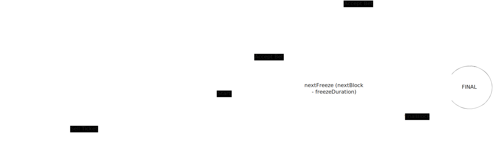

# Halving Massacre Game

This module hosts a Halving Massacre Game, being responsible for all the tracking, calculations and communication.

## The Game



### [Published events](docs/events.md)

### Rest endpoints

- [Create ticket](docs/rest/create_ticket.md)
- [Add power](docs/rest/add_power.md)

## Contributing

### Installation

```bash
pnpm i
```

### Testing

```bash
pnpm test
```

### Linting and prettier

```bash
pnpm lint
pnpm prettier
```

### Development Server

```bash
pnpm dev
```

### Docker Server

```bash
docker compose up
```
